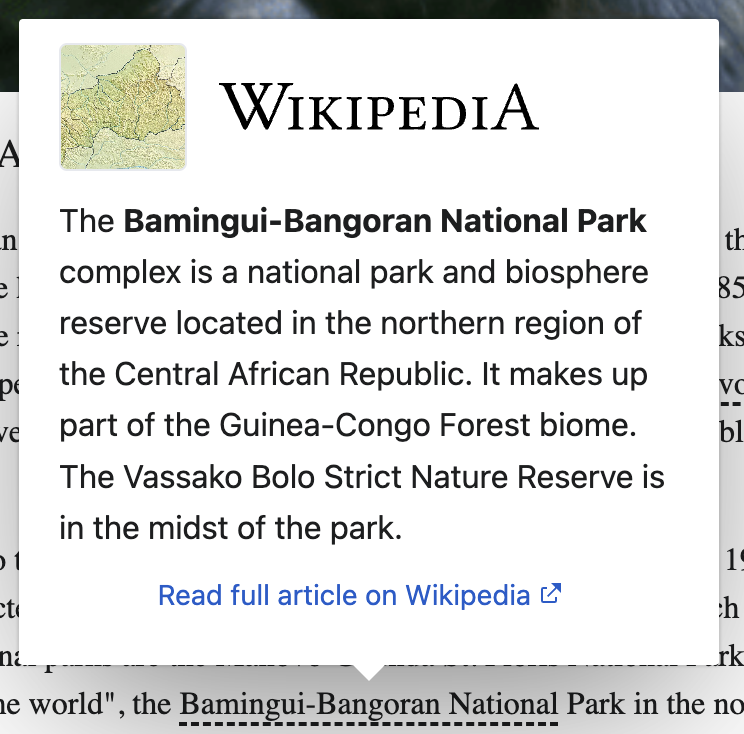

[](https://circleci.com/gh/wikimedia/wikipedia-preview/tree/main)

# Wikipedia Preview

Wikipedia Preview is a JavaScript component that allows you to provide context from Wikipedia about words or phrases on any website. It lets you show a popup card with a short summary from Wikipedia when a reader hovers over a link.

Desktop | Mobile
--- | ---
 | 

Storybook: https://wikimedia.github.io/wikipedia-preview/storybook-static

## Compatibility

Browsers | Versions
--- | ---
Chrome, Firefox, Opera, Edge | Current and previous version
Internet Explorer | 11+
Safari | 5.1+
iOS | 6.1+
Android | 4.1+


## Features

* Works with any link that has an article on Wikipedia
* Works for LTR languages
* Works for articles with or without a lead image

## Getting Started

### Standalone Script

```html
<script src="wikipedia-preview.production.js"></script>
<script type="text/javascript">
  wikipediaPreview.init()
</script>
```
You can serve the file yourself or include it from [unpkg](https://unpkg.com/browse/wikipedia-preview@latest/dist/wikipedia-preview.production.js).

### NPM
```bash
$ npm install wikipedia-preview --save
```

```javascript
const wikipediaPreview = require('wikipedia-preview')
wikipediaPreview.init()
```

### Options of the init function

The `init` function accepts the following options:

Name | Type | Default | Description
--- | --- | --- | ---
root | DOM Element | `document` | Where to look for elements that should have the popup
selector | string | `'[data-wikipedia-preview]'` | How nodes that should have the popup are identified
lang | string | `'en'` | Default Wikipedia language
popupContainer | DOM Element | `document.body` | Where to put the popup in the DOM
detectLinks | Boolean | `false` | Allow Wikipedia hyperlinks to have the popup
events | Object | `{}` | Custom event handlers: `{ onShow: <fn>, onWikiRead: <fn> }`

Example (custom selector)
```html
<p class="content">
	You can learn about <span class="wiki">Chat</span> and <span class="wiki">Chien</span> from Wikipedia.
</p>
<div class="popup-container"></div>
```

```javascript
wikipediaPreview.init({
	root: document.querySelector('.content'),
	selector: '.wiki',
	popupContainer: '.popup-container',
	lang: 'fr'
});
```

Example (detect Wikipedia links)
```html
<p class="content">
	You can learn about <a href="https://en.wikipedia.org/wiki/Chat">Chat</a> and <a href="https://en.wikipedia.org/wiki/Chien">Chien</a> from Wikipedia.
</p>
```

```javascript
wikipediaPreview.init({
	detectLinks: true
});
```

Example (custom event handlers)
```javascript
wikipediaPreview.init({
	events: {
		onShow: function(title, lang, type) {
			// call custom instrumentation here
		},
		onWikiRead: function(title, lang) {
			// call custom instrumentation here
		}
	}
});
```

### Attributes

#### data-wikipedia-preview

To indicate that a word or expression should bring up the article preview popup, mark it with the `data-wikipedia-preview` attribute (or anything else as long as you're using the `selector` option described above).

#### data-wp-title

When the article title is not the same as the node's `textContent` property, use the `data-wp-title` attribute to specify the article title.

#### data-wp-lang

To use a language different than the language specified in the options, use the `data-wp-lang` attribute.

#### .wmf-wp-with-preview

To use the default trigger link styling:

* Add the following link to the page header:
```html
<link href="wikipedia-preview.css" rel="stylesheet">
```
* Add the class `wmf-wp-with-preview` to the node

If you prefer to style them in a way that makes more sense for you context, simply don't include the `wikipediaPreview.css` link in header and add your own class to the node. Both of these are valid ways:

```css
[data-wikipedia-preview] {
	background-color: yellow;
}
```

```css
.my-own-css-style {
	background-color: yellow;
}
```

## Acknowledgements/Contributors

This is heavily inspired by [jquery.wikilookup](https://github.com/mooeypoo/jquery.wikilookup) and [Page Previews](https://www.mediawiki.org/wiki/Page_Previews).

